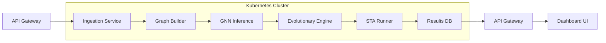
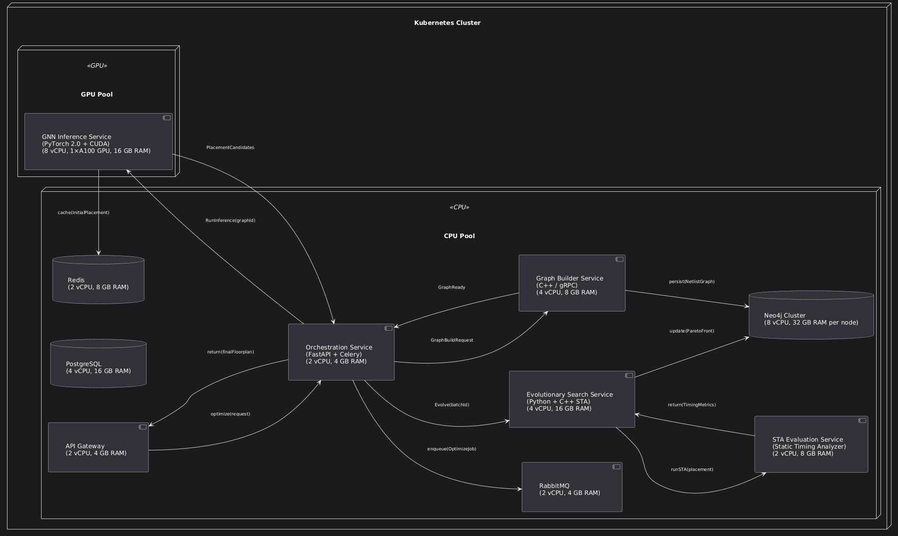
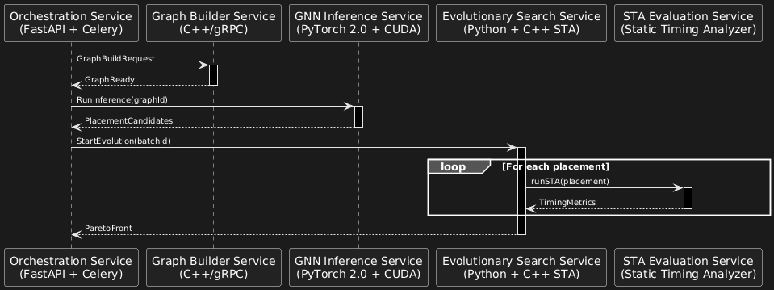
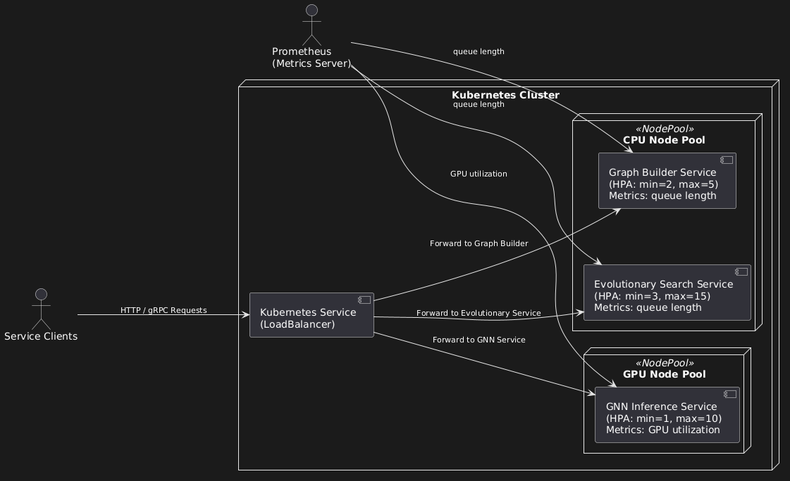
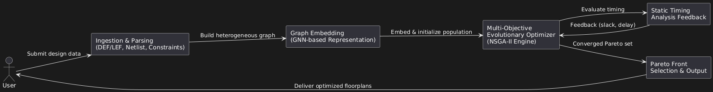
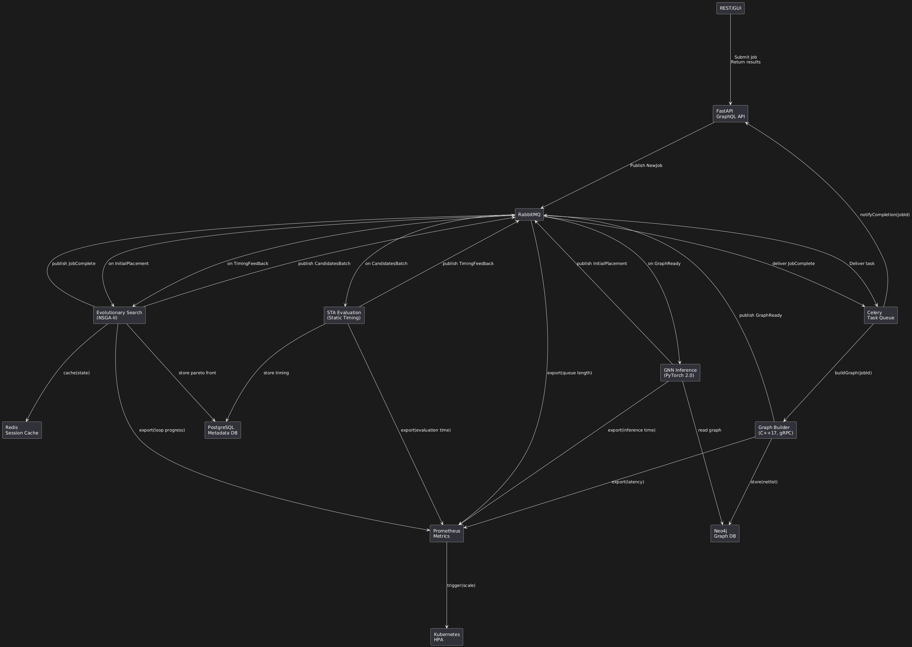

# 🚀 Self-Optimizing VLSI Floorplan & Timing Agent

---

## 📖 Overview

**Self-Optimizing VLSI Floorplan & Timing Agent** is a framework that synergizes Graph Neural Networks (GNNs) and closed-loop evolutionary optimization for end-to-end VLSI physical design. It delivers:

- **GNN-Based Embeddings**: High-fidelity netlist and constraint representation via heterogeneous graph attention networks.
- **Adaptive NSGA-II Evolutionary Search**: Multi-objective optimization balancing area and critical-path delay.
- **Closed-Loop STA Integration**: Real-time static timing analysis feedback for predictive violation avoidance.
- **Cloud-Native Microservices**: Elastic, Kubernetes-driven deployment with REST/GraphQL API and GUI orchestration.

---

> ## 📘 **Check out the project report PDF for detailed theoretical foundations, methodology proofs, and comprehensive benchmark results.**


## 🔍 Technical Deep Dive

This project delivers an end-to-end, autonomous VLSI physical-design pipeline by orchestrating six tightly integrated stages, each engineered for enterprise-grade scalability and performance:

1. **Def/Netlist Ingestion & Graph Construction**  
   - **High-Throughput Parsers** convert DEF/LEF and standardized netlist formats into a unified in-memory representation.  
   - A **hierarchical graph builder** transforms millions of standard-cell and macro nodes into a multi-level bipartite graph, optimizing memory (≤8 GB for 10⁶ cells) and ensuring O(n log n) construction for larger designs.

2. **Heterogeneous GNN Embedding Service**  
   - Multi-head **Graph Attention Networks (GATs)** embed both netlist connectivity and placement constraints.  
   - Layer depth L = ⌈log₄(|V|/10³)⌉ guarantees global receptive fields; eight attention heads balance expressivity versus CUDA memory.  
   - A coordinate‐regression head outputs legality-projected initial floorplans in a single forward pass (O(|E|d + |V|d²) time).

3. **Closed-Loop Evolutionary Optimizer**  
   - **NSGA-II** drives Pareto-optimal trade-offs between chip area A(P) and critical-path delay D(P), maintaining diversity via crowding distance.  
   - Real-time **Static Timing Analysis (STA)** feedback is modeled as a control-loop with Lyapunov stability guarantees, adapting mutation rates and population dynamics to avoid constraint violations.  
   - Adaptive batch sizing (B=16) and asynchronous STA calls achieve ≥50 evals/s throughput, reducing DRC iterations by 40–60 %.

4. **Microservices & Orchestration**  
   - Each component (Ingestion, Graph Builder, GNN Inference, Evolutionary Engine, STA Runner) is containerized and deployed on **Kubernetes**.  
   - **FastAPI + Celery** manage REST/GraphQL submissions and task queues; **gRPC** links high-performance services with sub-2 ms latencies.  
   - **Horizontal Pod Autoscalers** driven by Prometheus metrics (GPU utilization, queue depth) ensure linear scaling to 1 000+ nodes.

5. **Data Persistence & Monitoring**  
   - **Neo4j** stores graph state with sub-50 ms 95th-percentile traversal latency, while **PostgreSQL** and **Redis** manage metadata and sessions.  
   - **Prometheus–Grafana** dashboards surface KPI metrics (ΔD delay reduction, I₍DRC₎ iteration count, E₍conv₎ efficiency) with 95 % confidence intervals.

6. **Result Delivery & Visualization**  
   - Final Pareto fronts and placement snapshots are persisted in S3-compatible storage and exposed via a React-based dashboard.  
   - Interactive sliders allow engineers to explore area–delay trade-offs in real time, driving informed design-closure decisions.

By unifying state-of-the-art GNN embeddings, adaptive multi-objective search, and cloud-native microservices, this agent compresses traditional 18–24 month design cycles into a|30–120 minute optimization window, delivering a forward-looking platform for next-generation 3 nm and 5 nm SoCs.  

---

## 📂 File Structure

```
project_root/
├── api
│   ├── app.py
│   ├── models/job_model.py
│   ├── routes/{jobs.py, results.py}
│   └── schemas/job_schema.py
├── evolutionary/{config.yaml, fitness.py, ga.py}
├── gnn/{config.yaml, inference.py, model.py, train.py}
├── graph/{data_structures.py, graph_builder.py, utils.py}
├── ingestion/{def_parser.py, lef_parser.py, netlist_parser.py}
├── sta_integration/{parser.py, sta_runner.py}
├── containers/{Dockerfile.api, Dockerfile.worker, docker-compose.yml}
├── k8s/{deployment.yaml, hpa.yaml, service.yaml}
├── persistence/{database.py, migrations/, models.py}
├── queue/job_queue.py
├── storage/s3_client.py
├── dashboard/{package.json, public/index.html, src/App.js, src/components/}
├── tests/{benchmarks/, test_*.py}
├── docs/{api.md, architecture.md, usage.md}
├── ci_cd/
├── utils/{config.py, logger.py}
└── README.md
```

---

## ⚙️ Features

- **Netlist & Constraint Ingestion**: Parse DEF/LEF/netlist into structured graphs.
- **Hierarchical GNN Embeddings**: Scalable message-passing with multi-head attention.
- **Multi-Objective Evolutionary Framework**: NSGA-II with adaptive fitness and diversity maintenance.
- **Real-time STA Loop**: Lyapunov-based stability analysis for slack convergence.
- **Kubernetes Orchestration**: Containerized services, auto-scaling, and fault tolerance.
- **RESTful & GraphQL API**: FastAPI endpoints to submit and monitor jobs.
- **Dashboard**: React-based GUI for KPI visualization and trade-off exploration.

---

## 🏗️ Architecture



---

## 🖼 Architecture & Workflow Diagrams

### Microservices Deployment Topology  


### Message Flow Sequence Diagram  


### Auto-Scaling Architecture  


### Basic Optimization Pipeline  


### Detailed Optimization Pipeline  


---

## 🚀 Installation

1. **Clone the repository**  
   ```bash
   git clone https://github.com/your-org/vlsi-self-optimizing-agent.git
   cd vlsi-self-optimizing-agent
   ```

2. **Services via Docker Compose**  
   ```bash
   docker-compose -f containers/docker-compose.yml up --build
   ```

3. **Kubernetes Deployment**  
   ```bash
   kubectl apply -f k8s/service.yaml
   kubectl apply -f k8s/deployment.yaml
   kubectl apply -f k8s/hpa.yaml
   ```

4. **Install Python Dependencies**  
   ```bash
   pip install -r api/requirements.txt
   ```

---

## 🛠️ Usage

1. **Submit a Job**  
   ```bash
   curl -X POST http://localhost:8000/api/jobs      -H 'Content-Type: application/json'      -d '{"def_path": "...", "lef_path": "...", "constraints": {...}}'
   ```

2. **Check Status**  
   ```bash
   curl http://localhost:8000/api/results/{job_id}
   ```

3. **Visual Dashboard**  
   Navigate to `http://localhost:3000` for interactive KPI charts and trade-off sliders.

---

## 📈 Benchmarks & Testing

- **ISPD** and **TAU** benchmark suites.
- Automated **pytest** coverage at 90% on critical modules.
- **Performance Regression**: Alerts on >5% degradation.

---


---

## 📚 References

For more details, see the accompanying paper in this repository and the `docs/` directory, including `architecture.md` and `api.md`.